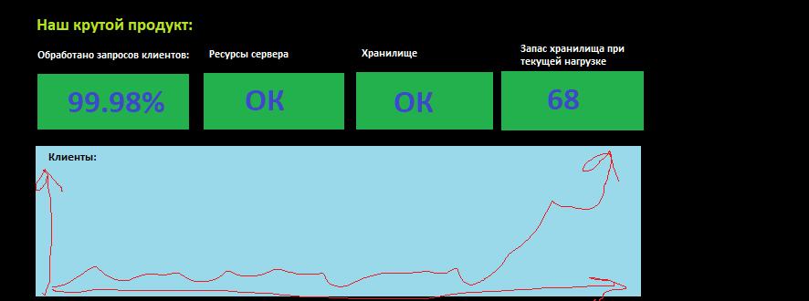

# Домашнее задание к занятию "10.01. Зачем и что нужно мониторить"

### 1. По условиям задания я рассматриваю сбор *метрик*, а не логов или трейсов. Я бы изначально рассмотрел сбор следующих метрик:
- свободное место. Предпочитаю помимо графика иметь алерт, который работает, если частное от остатка места в гигабайтах на его производную (скорость расходования места за, скажем, сутки) с достаточным запасом кол-ва дней, необходимых для расширения хранилища (с учётом всех согласований, аренды, закупок и т.д. и т.п.)  
- технический мониторинг хранилища (inodes, iops в % от макс. и т.п.) + алерт  
- LA, CPU фактическое за 5 сек. Из него уже пересчитываем на большие интервалы, которые для нас показательны. Алерты при длительной высокой нагрузке, и в связке с последним пунктом (кол-во ответов с кодами, отличными от 200 или что мы считаем нормальным)
- Free RAM в виде виджета "OK" и алерта при значениях >80-90%. Тут я предполагаю, что сервис по ТЗ их не должен активно использовать, намного раньше упрёмся по хранилищу либо в место, либо в IOPS. За графиком понаблюдал бы, но в данной формулировке задачи не вижу в нём смысла на Dashboard'е.
- % ответов с 200 HTTP-кодом от общего числа. Это мониторинг бизнес-логики, что наш приклад как минимум работает и отвечает.

### 2. Нарисовать примерно следующий dashboard:


### 3. При отсутствии финансирования на систему мониторинга мне видятся следующие пути решения проблемы:
- использование бесплатных opensource решений;  
- использование списанного или офисного оборудования (в конце концов выход из строя сервера мониторинга не вызывает сбой сервиса, т.е. в теории как бы это не так чтоб уж страшно);  
- настройка ротации логов (если у нас уже есть некоторые мощности, а бюджет не выделен именно на расширение);  
- использование систем, позволяющих хранить детальные данные за небольшой период, а за предыдущие - в обобщённом виде, что так же позволяет экономить дисковое пространство.

### 4. Ошибка в том, что не учтены коды перенаправлений (3хх). Например, ресурс у нас предполагает использование https. Если пользователь обратился к ресурсу по http, то, при корректно настроенном перенаправлении, сервер сначала ответит ему 301, перенаправив его на https, а затем уже ответит 200. При приведенной настройке успешные ответы составили бы 50%, хотя 3хх коды не говорят о сбоях в работе приложения. Перенаправления не говорят о сбоях в работе ресурсы.

### 5. Задание со звездочкой  
  
Сам [скрипт](my_awesome_exporter/my_awesome_exporter.py)  
Пример [лога](my_awesome_exporter/09-01-22_awesome_monitoring.json)  
Пример записи, которую необходимо внести в /etc/crontab раз в минуту:  
```
* * * * * root /usr/bin/python3.8 /opt/my_awesome_exporter.py
```