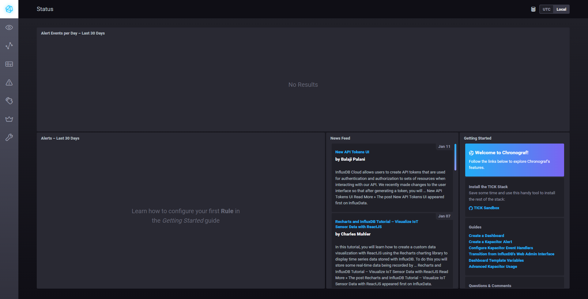
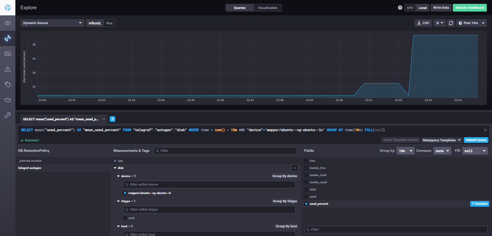
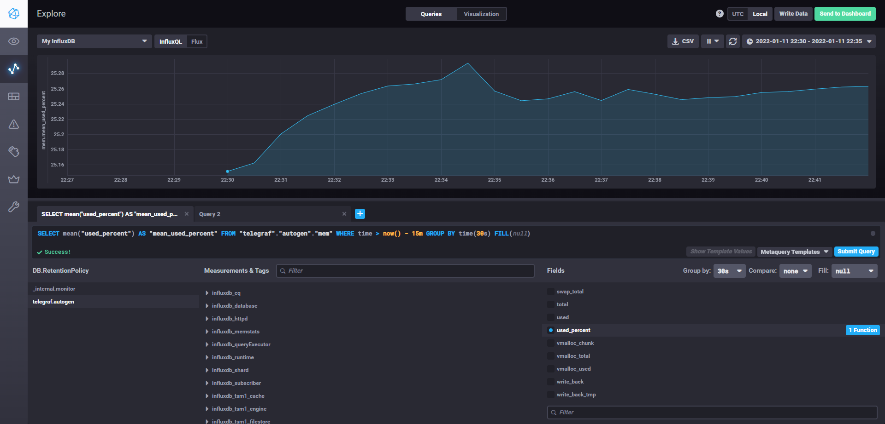
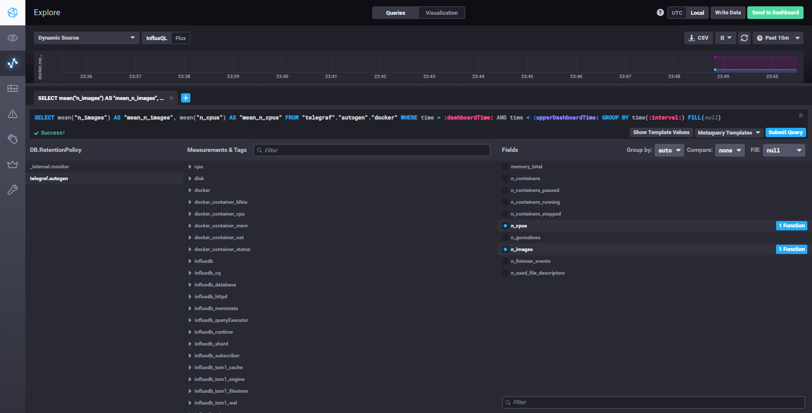
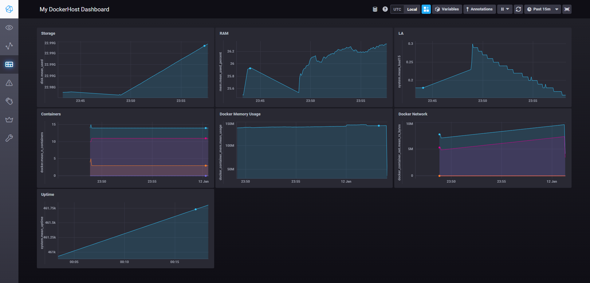

# Домашнее задание к занятию "10.02. Системы мониторинга"  

### 1. Опишите основные плюсы и минусы pull и push систем мониторинга.  

<table>
 <tr>
    <td width="8%"></td>
    <td width="46%"><b>PUSH</b></td>
    <td width="46%"><b>PULL</b></td>
 </tr>
 <tr>
    <td ><b>Плюсы</b></td>
    <td align = "justify" valign="top">
        1. Простота при автоматических развертываниях, т.к. преднастроенный агент из разворачиваемого образа сразу сможет доставить метрики без дополнительной настройки централизованной системы мониторинга. <br />
        2. Возможность настройки различной частоты отправки различных метрик на конечной машине (какие-то метрики нам нужны раз в 10 сек, а другие раз в сутки), что может значительно сэкономить место на хранилище логов <br />
    </td>
    <td align = "justify" valign="top">
        1. Полный контроль над получаемыми данными. Мы опрашиваем только те узлы и до тех пор, которые нам интересны.<br />
        2. Можно разместить экспортеры за балансировщиком, а передаваемые данные надёжно защитить с помощью TLS. <br />
        3. Запрашивать данные можно с любой периодичностью, с либого числа систем мониторинга или самодельных скриптов.
    </td>
 </tr>
 <tr>
    <td><b>Минусы</b></td>
    <td align = "justify" valign="top">
        1. Как правило push-агенты передают данные в своём двоичном формате. Это накладывает ограничения на использование L7-балансировщиков<br />
        2. В определенный момент времени может получить больше одновременных запросов, чем сможет обработать. Есть риск потери данных. <br />
        3. Как правило данные передаются в открытом виде. Риск утечки данных.
    </td>
    <td align = "justify" valign="top">
        1. Невозможность запрашивать с одного экспортера разные метрики с разной периодичностью (только все сразу)<br />
        2. При автоматическом масштабировании системы нужна дополнительная автоматизация добавления новых инстансов в систему мониторинга.
    </td>
 </tr>
</table>

### 2. Какие из ниже перечисленных систем относятся к push модели, а какие к pull? А может есть гибридные?

- Prometheus - PULL. Но следует также отметить, что для Prometheus существует Push Gateway, который будет принимать и хранить у себя метрики с push-агентов, которые в дальнейшем будет забирать Prometheus.  
- TICK - агентом в стеке является telegraf, он работает в PUSH модели
- Zabbix - гибридная. По-умолчанию работает в режиме PUSH, но позволяет настроить и PULL-режим.
- VictoriaMetrics - как я понял из доментации это Prometheus-совместимая TSDB, куда PUSH'ат метрики другие TSDB или агенты.
- Nagios - PULL

### 3. Результат выполнения команд:
```
# curl http://localhost:8086/ping
# curl http://localhost:8888
<!DOCTYPE html><html><head><meta http-equiv="Content-type" content="text/html; charset=utf-8"><title>Chronograf</title><link rel="icon shortcut" href="/favicon.fa749080.ico"><link rel="stylesheet" href="/src.3dbae016.css"></head><body> <div id="react-root" data-basepath=""></div> <script src="/src.fab22342.js"></script> </body></html>root@docker01:/home/kisa/sandbox#
# curl http://localhost:9092/kapacitor/v1/ping
#
```
Т.к. ответы на запросы к /ping оказались пустыми, я решил повторить их с флагом --verbose, чтобы посмотреть заголовки:
```
# curl --verbose http://localhost:9092/kapacitor/v1/ping
*   Trying 127.0.0.1:9092...
* TCP_NODELAY set
* Connected to localhost (127.0.0.1) port 9092 (#0)
> GET /kapacitor/v1/ping HTTP/1.1
> Host: localhost:9092
> User-Agent: curl/7.68.0
> Accept: */*
>
* Mark bundle as not supporting multiuse
< HTTP/1.1 204 No Content
< Content-Type: application/json; charset=utf-8
< Request-Id: dfe5d20a-7310-11ec-8062-000000000000
< X-Kapacitor-Version: 1.6.2
< Date: Tue, 11 Jan 2022 19:01:25 GMT
<
* Connection #0 to host localhost left intact

# curl --verbose http://localhost:8086/ping
*   Trying 127.0.0.1:8086...
* TCP_NODELAY set
* Connected to localhost (127.0.0.1) port 8086 (#0)
> GET /ping HTTP/1.1
> Host: localhost:8086
> User-Agent: curl/7.68.0
> Accept: */*
>
* Mark bundle as not supporting multiuse
< HTTP/1.1 204 No Content
< Content-Type: application/json
< Request-Id: f100b0fa-7310-11ec-8073-0242ac130003
< X-Influxdb-Build: OSS
< X-Influxdb-Version: 1.8.10
< X-Request-Id: f100b0fa-7310-11ec-8073-0242ac130003
< Date: Tue, 11 Jan 2022 19:01:54 GMT
<
* Connection #0 to host localhost left intact
``` 

А также скриншот Chronograf:


### 4. В текущей версии sandbox не собирались метрики ни памяти контейнера, ни диска. Для того, чтобы это исправить, я отредактировал файл ./telegraf/telegraf.confдобавив в него секции:
```
[[inputs.disk]]
  ## By default stats will be gathered for all mount points.
  ## Set mount_points will restrict the stats to only the specified mount points.
  # mount_points = ["/"]

  ## Ignore mount points by filesystem type.
  ignore_fs = ["tmpfs", "devtmpfs", "devfs", "iso9660", "overlay", "aufs", "squashfs"]
```
и 
```
[[inputs.mem]]
```

Также добавил монтирование корневой файловой системы внутрь контейнера и соответствующие переменные окружения, доведя до следующего вида:
```
  telegraf:
    # Full tag list: https://hub.docker.com/r/library/telegraf/tags/
    build:
      context: ./images/telegraf/
      dockerfile: ./${TYPE}/Dockerfile
      args:
        TELEGRAF_TAG: ${TELEGRAF_TAG}
    image: "telegraf"
    environment:
      HOSTNAME: "telegraf-getting-started"
      HOST_MOUNT_PREFIX: "/hostfs"
      HOST_PROC: "/hostfs/proc"
    # Telegraf requires network access to InfluxDB
    links:
      - influxdb
    volumes:
      # Mount for telegraf configuration
      - ./telegraf/:/etc/telegraf/
      # Mount for Docker API access
      - /var/run/docker.sock:/var/run/docker.sock
      - /:/hostfs:ro
    depends_on:
      - influxdb
```
Перезапустил контейнер:
```
# docker-compose -f ./docker-compose.yml restart telegraf
Restarting sandbox_telegraf_1 ... done
```
и требуемые метрики появились (утилищация диска докер-хоста, временной интервал и интервал группировки указаны вручную):



### 5. Плагин для Docker уже был активирован, нужно только поправить разрешения на /var/run/docker.sock и метрики начали собираться:


### 6. *
Собрал следующий Dashboard:

