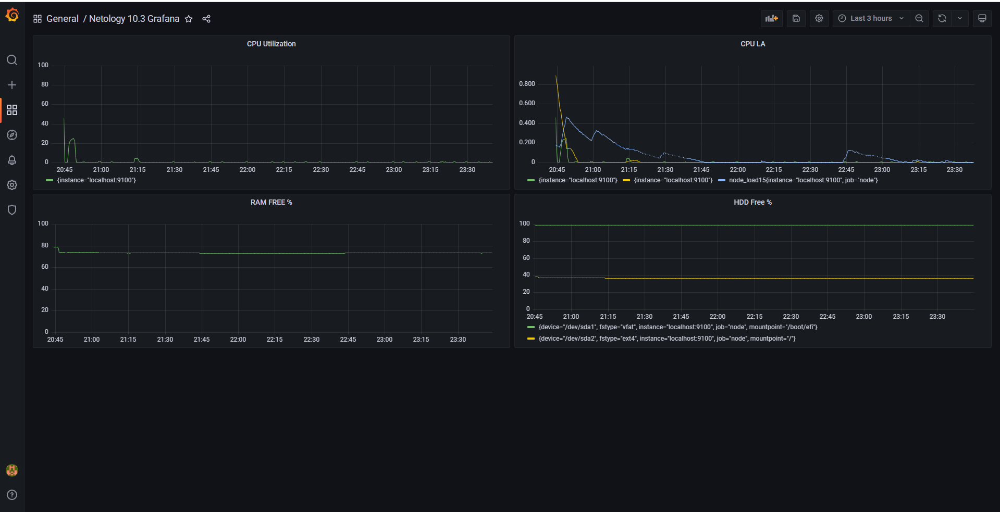
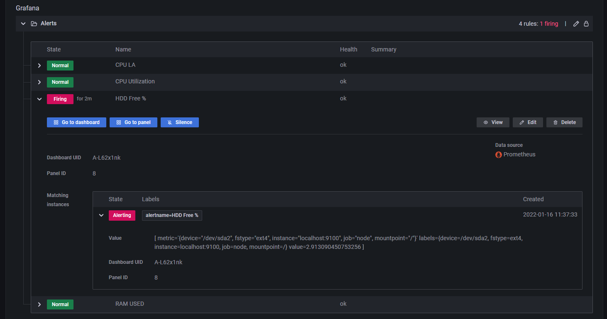

# Домашнее задание к занятию "10.03. Grafana"

## Задание 1. 
В принципе сам для себя чуть ранее набросал [docker-compose](docker-compose/), аналогичный тому, что шёл в комплекте с заданием. У меня он разделен на две части (серверная и клиентская), а так же в клиентской я ставил node_exporter и cadvisor. По-этому раз уж делать сложный вариант, то решил написать ещё и [ansible-playbbok](ansible/). Тестировал на Ubuntu Server 20.04.3.  

## Задание 2.
Запросы получились следующими:
- 100 - (avg by (instance) (rate(node_cpu_seconds_total{job="node",mode="idle"}[1m])) * 100)
- node_load1{}, node_load5{} и node_load15{}
- node_memory_MemFree_bytes / node_memory_MemTotal_bytes * 100
- node_filesystem_avail_bytes{fstype!~"tmpfs|fuse.lxcfs|squashfs"} / node_filesystem_size_bytes{fstype!~"tmpfs|fuse.lxcfs|squashfs"} * 100

## Задание 3.  
Настроил алерты: 
  

Добавил новый канал - Telegram, [конфиг в формате JSON](alerting.json):  

Создал "проблему":  

И получил соответствующее уведомление в telegram:

## Задание 4.   

[JSON Model](dashboard.json)