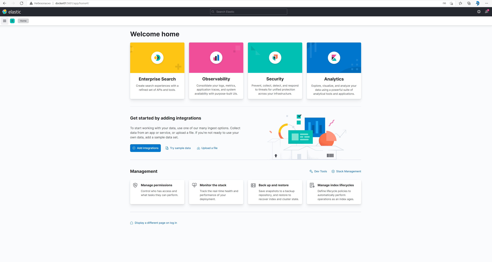
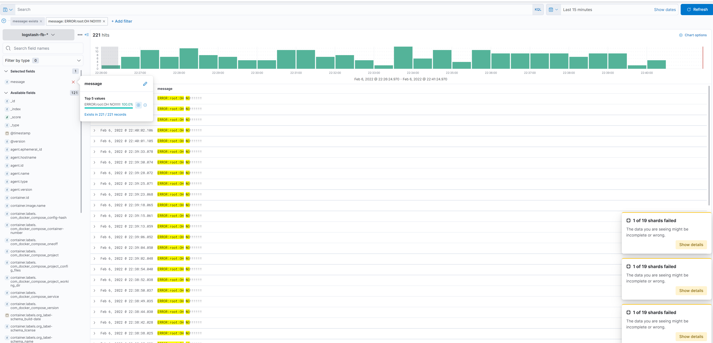

1.

При написании docker-compose файла возник ряд ошибок, которые были успешно решены при изучении материала по ссылкам. Среди них были:
 - max virtual memory areas vm.max_map_count [65530] is too low
 - ошибки конфигурирования кластера Elasticsearch
 - ошибка доступа filebeat к сокет-файлу докера
 - проблемы запуска Kibana
 и многое другое. Подробно не описываю, т.к. набор ссылок для изучения явно подразумевал прохождение по этим граблям.

Манифест и конфиги работоспособной сборки находятся в данном репозитории.
на данный момент сборка проработала без сбоев 8 минут:

```
$ docker ps | grep elk
c4bd3beaf626   docker.elastic.co/beats/filebeat:7.17.0                "/usr/bin/tini -- /u…"   8 minutes ago    Up 8 minutes                                                                                                     elk-filebeat
77206a49f5bf   docker.elastic.co/logstash/logstash:7.17.0             "/usr/local/bin/dock…"   17 minutes ago   Up 17 minutes   0.0.0.0:5000->5000/tcp, :::5000->5000/tcp, 0.0.0.0:9600->9600/tcp, :::9600->9600/tcp, 5044/tcp   elk-logstash
d509960257b0   docker.elastic.co/kibana/kibana:7.17.0                 "/bin/tini -- /usr/l…"   17 minutes ago   Up 17 minutes   0.0.0.0:5601->5601/tcp, :::5601->5601/tcp                                                        elk-kibana
68598741d7a3   docker.elastic.co/elasticsearch/elasticsearch:7.17.0   "/bin/tini -- /usr/l…"   17 minutes ago   Up 17 minutes   0.0.0.0:9200->9200/tcp, :::9200->9200/tcp, 9300/tcp                                              elk-es01
94fa1cd2edc9   docker.elastic.co/elasticsearch/elasticsearch:7.17.0   "/bin/tini -- /usr/l…"   17 minutes ago   Up 17 minutes   9200/tcp, 9300/tcp                                                                               elk-es02
```

2. На данном этапе возникло очень много вопросов, что спустя часа 4 было решено взять готовую сборку из папки help и... она так же не заработала. Цикличный перезапуск контейнеров, отсутствие логов, Kibana not ready yet...

Спустя некоторое время было решено вернуться к свособственной сборке. 

Всех логов с ошибками сейчас не приведу, т.к. потрачено много часов на дебаг, опишу лишь основные проблемы, которые запомнил:
 - была проблема с тем, что вместо json сыпался какой-то байткод и ошибка декодирования json. В интернете ничего толком на эту тему не написано, да и кодировка везде используется utf-8, о чём написано как в документации, так и видно по самим файлам. Решил эту проблему сменив tcp сокет, который требовался по заданию на beats
 ```
input {
    beats {
    port => 5000
    codec => json
  }
}
 ```

  - вторая проблема была связана с невозможностью поиска логов, т.к. приложение run.py генерирует логи не в json-формате. А логи docker - в json. В итоге - каша. Исправил [run.py](pinger/run.py) на генерацию логов в json-формате. После данных мероприятий логи стали похожи на логи. Исправленный код лежит в этом репозитории.




  PS: Данное задание потребовало огромное количество времени и сил на то, чтобы понять что вообще не так и вместо положительных эмоций доставило скорее отрицательные. Надеюсь, ошибки в задании будут исправлены, т.к. пока не разбираешься в стеке, дебажить его крайне сложно.