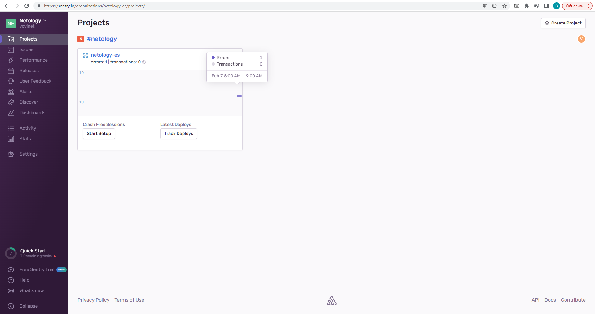

# Домашнее задание к занятию "10.05. Sentry"

## Задание 1.  
Зарегистрировался на [sentry.io](https://sentry.io/), используя GitHub-аккаунт, создал python-проект, вставил предложенный код в своё приложение и тут же получил первый issue :)
  

Привожу скриншот раздела Projects  


## Заданеи 2.

В данном задании возник один вопрос, который, впрочем, не помешал выполнению задания.  
Где именно нужно было сделать ```нажмите Generate sample event```? В интерфейсе я такого не нашёл, в системе помощи тоже о таком функционале упоминаний не нашёл.  

Тем не менее, у меня есть рабочий [python-код](demo.py), который позволяет эти события гененрировать.  
Скриншот со Stack srace  
  

Скриншот с Resolved Issue  
  

## Задание 3.  
Оповещение получено на e-mail:  


## Задание со *.  
На данном этапе у меня уже создан небольшой [python-код](demo.py), но я решил поэкспериментировать ещё и [golang](demo.go). Хочу сказать, что не зря. В go мне потребовалось чуть больше движений, да и большая часть горутин уже перехватывает исключения, возвращая ошибки. В данном примере я пробовал передавать как отладочную информацию, так и стек трейс из кода ошибки функции http.ListenAndServe при попытке запуска на занятом порту.  

  

  